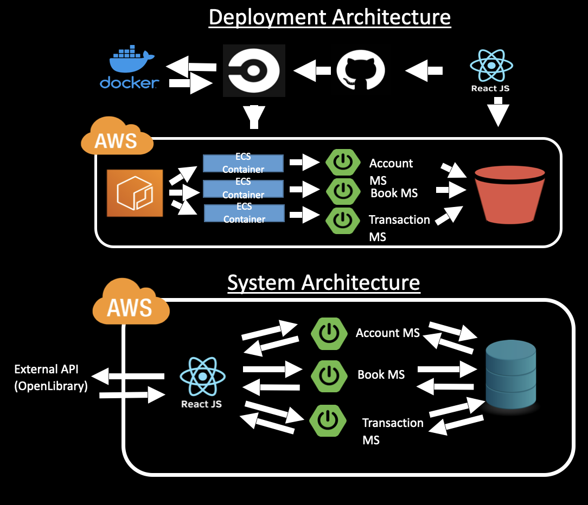
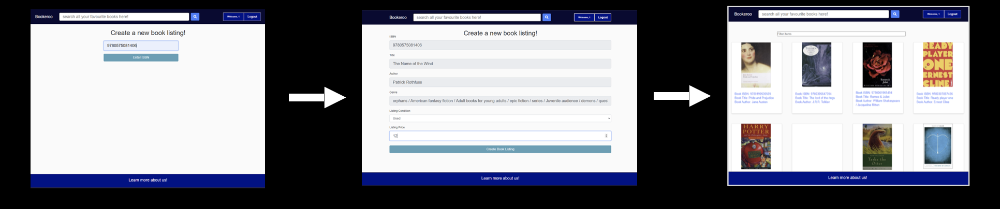
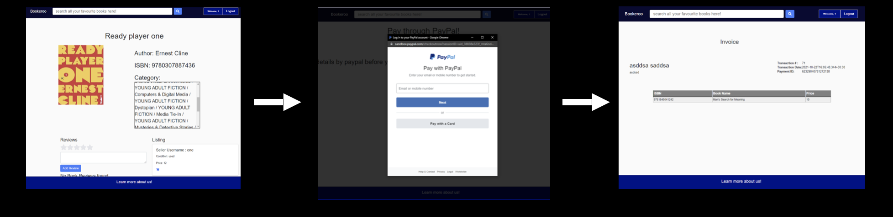

<h1 align="center">Bookeroo 2021</h1>

    RMIT SEPT 2021 Major Project
     
    Developed by:  
    
    Abdulrahman Ali - Lead Developer
    Mac Arriero - Scrum Master/Junior Developer
    Rohan Poorun - Junior Developer
    Aditya Kerhalkar - Junior Developer
    Jehan Perera - Junior Developer

<h2 align="center" >Description</h2>

    Bookeroo is a web application where users can buy and sell books. There are four types of users that can be registered on the site - basic users, shop owners, publishers and site admin.Users can view a range of books listed by other users. When creating a book listing, the user must enter the ISBN of the book, and then we use the OpenLibrary API to validate the existence of the book and retrieve all the relevant details, such as the title, author and genre. If listed a user may purchase the book from another user with the payment transaction processed using PayPal API. 

<h2 align="center" >Technology & Architecture</h2>

    Back-End : Java - Spring Boot
    Front-End : JSX, CSS & Javascript -  React.js
    Database: SQL - Postgres
    CI/CD : Circle CI
    Container service : Docker
    Deployment : AWS ECS for back-end and S3bucket for front-end
    Container Registry : AWS ECR
    Product tracking : Jira / GitHub

<h2 align="center" >Key features</h2>
<h3>Book listing</h3>

    Uses an external API (OpenLibrary) to validate and retrieve book information based on the book ISBN. If the ISBN is not validated by the OpenLibrary API, the website will deny creating the listing and will display a message that the ISBN is invalid. If valid, the website will automatically create the form with the book details and prompt the user to enter a price and condition.

    

 
<h3>Book Purchase</h3>

    Integrates Paypal as a main payment method. Users can only purchase an individual book at a time. The application confirms if the payment was successful from the Paypal API response before they can fill out their billing and delivery information. A transaction receipt is available for the users to view upon a successful transaction.

    

<h2 align="center">Instructions to run locally</h2>

<h3>Backend microservices</h3>

    1) Using a integrated development enviroment (IDE) that supports Maven projects, navigate to the "BackEnd" directory and open each microservice (ms_booking, ms_login, ms_transactions)
    2) Run each of the microservice on your IDE.

<h3>Frontend - React</h3>

    1) cd into FrontEnd/myfirstapp
    2) run "npm install"
    3) run "npm start"

